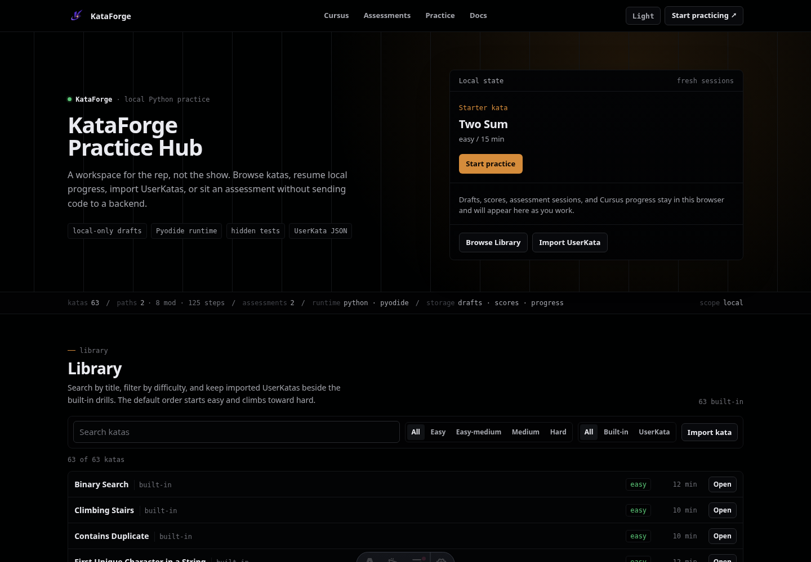
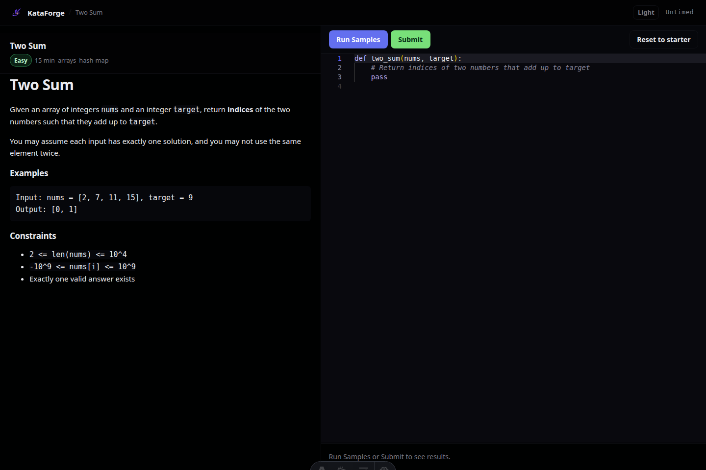

<p align="center">
  
</p>

<h1 align="center">KataForge</h1>

<p align="center">
  <strong>Build and practice custom coding assessments locally.</strong><br />
  A private, browser-based kata hub for interview prep, technical training, and custom assessment design.
</p>

<p align="center">
  <a href="#quick-start">Quick start</a> ·
  <a href="#visual-tour">Visual tour</a> ·
  <a href="#adding-a-kata">Adding a kata</a> ·
  <a href="#documentation">Docs</a>
</p>

## Visual tour

Screenshots below are captured from the actual local app.

### Practice hub

Browse built-in katas, resume local activity, import UserKatas, and start assessments from one homepage.



### Browser coding workspace

Solve katas in a split-pane workspace with problem statements, a Monaco editor, sample runs, and submit-time tests.



## Why KataForge?

| Capability | What it gives you |
| --- | --- |
| Local-first practice | Drafts, scores, assessment sessions, and cursus progress stay in your browser. |
| Browser Python runtime | Solutions run in a Pyodide-powered Web Worker during MVP practice. |
| Custom ProblemPacks | Define problems, visible tests, hidden tests, assessments, lessons, and checkpoints on disk. |
| UserKata import | Paste generated kata JSON from `/docs` and practice immediately without rebuilding. |
| Assessment mode | Run timed multi-kata sessions with results and retry flows. |

## Quick start

Requires Node.js `>=22.12.0` and pnpm.

```bash
pnpm install
pnpm dev
```

Open http://localhost:4321.

## Scripts

| Command | Description |
| --- | --- |
| `pnpm dev` | Start the local dev server. |
| `pnpm build` | Generate built-in kata metadata and build for production. |
| `pnpm exec kataforge check` | Validate configured ProblemPack content before running the app. |
| `pnpm preview` | Preview the production build locally. |
| `pnpm test` | Run unit tests. |
| `pnpm test:e2e` | Build and run Playwright smoke tests. |
| `pnpm lint` | Run Astro/TypeScript checks. |

## Adding a kata

### UserKata browser import

1. Open `/docs` in the app.
2. Copy the LLM authoring template.
3. Generate a single UserKata JSON object.
4. Use **Import kata** on the Practice hub.

Imported UserKatas appear immediately without a rebuild. Export or remove them with **Manage imported** on the hub.

### ProblemPack disk overlay

For durable local content, create Markdown problem files in `examples/problems/` or private gitignored folders. See [Problem format](./docs/problem-format.md).

To load personal katas and assessments from a gitignored overlay:

```bash
cp kataforge.local.example.json kataforge.local.json
```

Place private content under `private/problems/` and `private/assessments/`. See [CONTEXT.md](./CONTEXT.md) for project context.

Run `pnpm exec kataforge check` after editing ProblemPack files to validate the merged config, problems, assessments, cursus files, lessons, checkpoints, and cross-file references before starting the app.

If `kataforge.local.json` contains invalid JSON, KataForge logs a warning and falls back to the committed base config. Set `KATAFORGE_STRICT_CONFIG=1` to fail the build instead, which is useful for CI validation.

> Static hosts must serve `404.html` for unknown paths so imported UserKata routes like `/problem/{id}` and `/results/{id}` work after import.

## Known limitations

- Python runs in the browser via Pyodide, so the first runtime load can be slow.
- Hidden tests bundled for browser execution are inspectable and should not be treated as secret.
- There is no authentication or multi-user support in the MVP.

## Security

- **Browser execution:** Python runs locally via [Pyodide](https://pyodide.org/) inside a Web Worker. Code never leaves the browser during MVP practice.
- **Hidden tests are inspectable:** Submit TestCases ship in the client bundle and saved results live in `localStorage`. Treat browser-side hidden tests as obscured, not secret.
- **No unsandboxed server execution:** Do not run candidate code in a plain server process. For multi-user or production deployments, use a sandboxed remote judge. See [Judge engine](./docs/judge-engine.md) and [ADR 0001](./docs/adr/0001-browser-pyodide-judge.md).

## Documentation

- [Problem format](./docs/problem-format.md)
- [Judge engine](./docs/judge-engine.md)
- [UI requirements](./docs/ui-requirements.md)
- [Architecture](./docs/architecture.md)
- [Domain glossary](./CONTEXT.md)

## License

MIT — see [LICENSE](./LICENSE).
